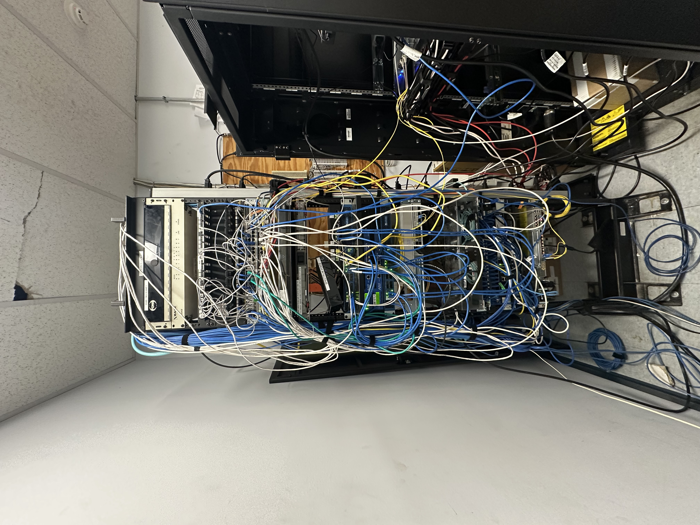
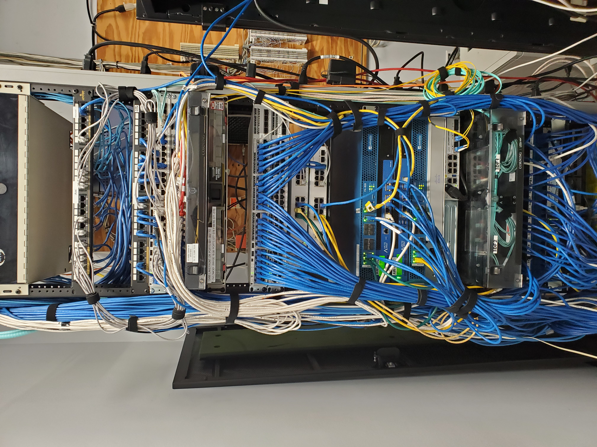

Warehouse Network Modernization & Zero-Downtime Resiliency Upgrade — 2025

Solo-executed end-to-end infrastructure overhaul across two active distribution warehouses while maintaining 100% operational uptime.

Duration: March 10 – June 16, 2025  
Role: Sole On-Site Engineer (remote assistance from NY teammate) 
**Project Owner/Author**: Charlie Hofner  
**LinkedIn**: [LinkedIn](https://www.linkedin.com/in/charlie-hofner/) 

One-Page Case Study
→ Download PDF: Charlie_Hofner_Warehouse_Network_Modernization_2025.pdf

Project Highlights
- Replaced all EOL Cisco 2960X switches with Catalyst 9200L-48P (5-member core stack + redundant IDF switches)
- Eliminated every single point of failure (warm spares, dual PSUs, 1500 VA APC UPS)
- Deployed two Arctic Wolf AWN202 MDR sensors in-line under the Palo Alto firewalls
- Decommissioned ancient plywood-mounted analog PBX → completed Vantage Unified cloud VoIP migration
- Turned decade-old rat’s-nest cabling into clean, labeled, service-friendly runs with proper lengths + Velcro
- Saved several thousand dollars through direct vendor negotiation
- Delivered 30–50% spare capacity for future expansion

Execution Timeline (Zero Production Impact)
- 8 weeks planning + triple port audits
- Thursday midday → secondary warehouse cutover in ~1 hour (validated with live RF-gun barcode scan)
- Friday night → pre-racked both main-warehouse IDF cabinets (scissor-lift, 500 ft apart)
- Saturday 8 am – 4 pm → core stack + final connections (Sunday contingency unused)

Before → After

| Before (rat’s nest)                  | After (clean & professional)         |
|--------------------------------------|--------------------------------------|
|       |         |
|         |           |

Technologies
Cisco Catalyst 9200L • StackWise • Palo Alto PA-820 • Arctic Wolf AWN202 • Aruba APs • APC Smart-UPS • Vantage Unified VoIP

Happy to discuss warehouse/DC networking, zero-downtime migrations, or security hardening anytime.

— Charlie Hofner  
[linkedin.com/in/charlie-hofner](https://www.linkedin.com/in/charlie-hofner/) • charles.hofner@gmail.com
